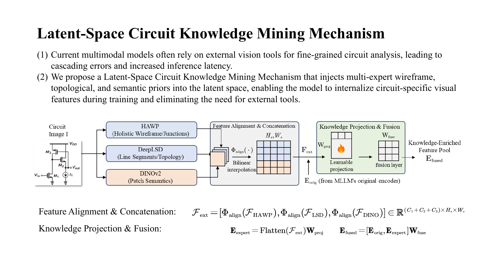
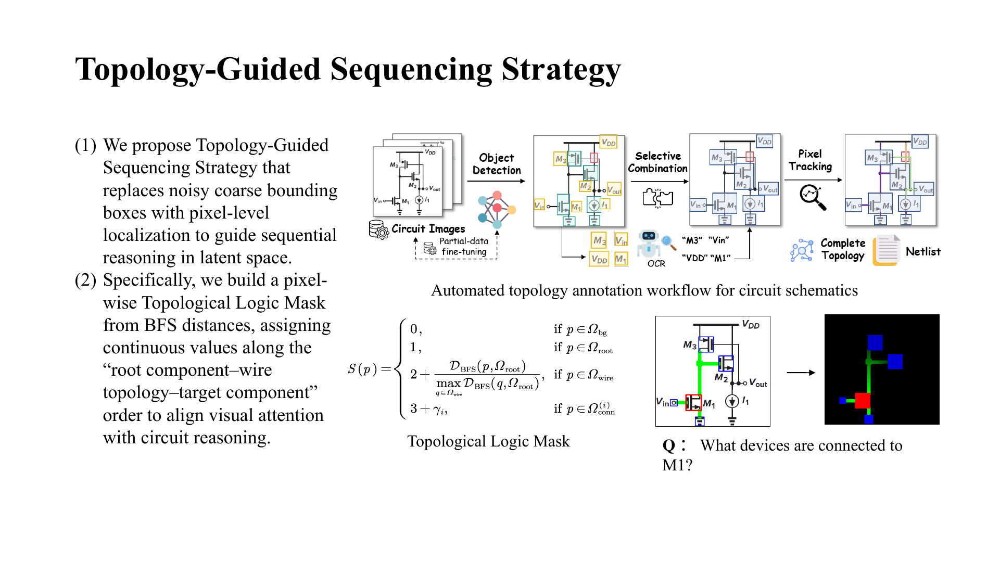
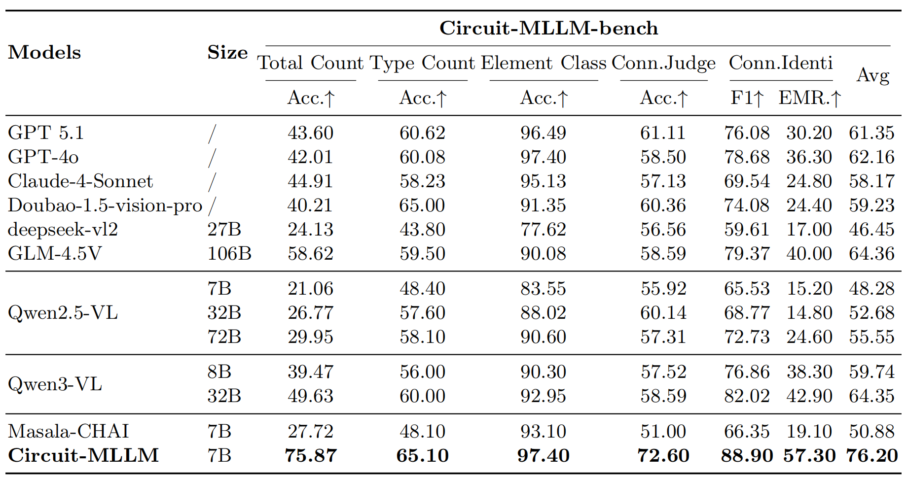
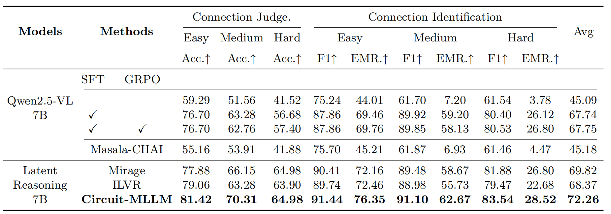
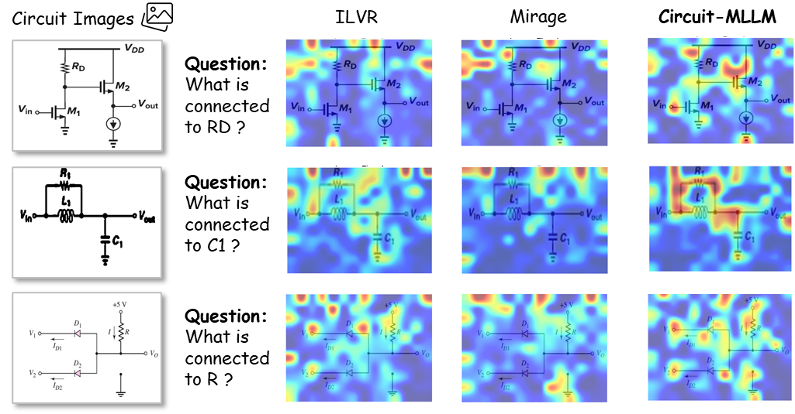
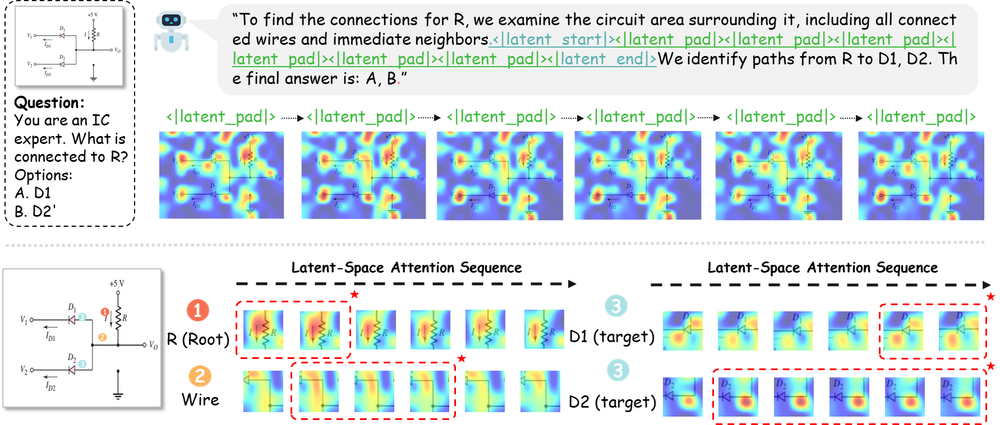

<div align="center">

# Circuit-MLLM

### Topological Logic-Guided Latent-Space Visual Reasoning for Circuit Schematic Understanding

**Jinyuan Deng, Yuqi Jiang, Wenjing Huang, Xin Li, Qi Sun, and Cheng Zhuo**<br>
Zhejiang University, Hangzhou, China

Contact: [12447016@zju.edu.cn](mailto:12447016@zju.edu.cn)

[](https://github.com/IC-Yuan/Circuit-MLLM)
[](https://www.python.org/)
[](https://huggingface.co/Qwen/Qwen2.5-VL-7B-Instruct)

</div>

Circuit-MLLM is a latent-space visual reasoning framework for circuit schematic understanding. It teaches an MLLM to follow circuit topology instead of raster-scan order by combining circuit-specific visual experts, pixel-level topological supervision, and interleaved text-latent training.

> Repository status: training and evaluation code is available. Dataset and trained-checkpoint download links will be added when the public artifacts are finalized.

## Timeline

- **2025-12-05**: Created the project repository and started organizing the Circuit-MLLM codebase.
- **2026-02-17 – 2026-02-18**: Added the first training, evaluation, and experiment materials.
- **2026-06-30**: Updated the project documentation and public repository materials.
- **2026-09-11**: Reorganized the public release with reproducible path configuration, launch scripts, and architecture/result figures.
- **2026-09-13**: Added the staged-release note and project contact information.

## Coming Soon

- Clean up and selectively release the remaining core topology-guided training implementation.
- Add finalized dataset, checkpoint, and expert-weight instructions where redistribution is permitted.
- Provide a compact end-to-end reproduction recipe and updated benchmark results.

## Overview

Circuit schematics contain long wires, junctions, branches, and irregular spatial layouts. Cropping can break connectivity, while ordinary patch order does not match the order used to reason through a circuit. Circuit-MLLM addresses these issues with three components:

1. **Latent-space circuit knowledge mining.** HAWP captures holistic wireframes and junctions, DeepLSD captures line segments and local topology, and DINOv2 supplies patch-level semantics. Their aligned features are projected and fused with the MLLM visual features.
2. **Topology-guided sequencing.** A pixel-level topological logic mask follows the root-component, wire-path, target-component order. Valid patch features are sorted by this mask and pooled into a fixed number of latent targets.
3. **Text-latent joint supervision.** Cross-entropy trains the surrounding text while a cosine alignment objective supervises generated latent tokens with the topology-ordered visual targets.

<p align="center">
  
</p>

<p align="center">
  
</p>

## Results

On Circuit-MLLM-bench, the 7B Circuit-MLLM model reaches an overall average score of **76.20** across five task categories.

| Model | Size | Total Count Acc. | Type Count Acc. | Element Class Acc. | Connection Judge Acc. | Connection ID F1 | Connection ID EMR | Avg. |
|---|---:|---:|---:|---:|---:|---:|---:|---:|
| Qwen2.5-VL | 7B | 21.06 | 48.40 | 83.55 | 55.92 | 65.53 | 15.20 | 48.28 |
| Qwen3-VL | 32B | 49.63 | 60.00 | 92.95 | 58.59 | 82.02 | 42.90 | 64.35 |
| GPT-4o | - | 42.01 | 60.08 | **97.40** | 58.50 | 78.68 | 36.30 | 62.16 |
| Circuit-MLLM | 7B | **75.87** | **65.10** | **97.40** | **72.60** | **88.90** | **57.30** | **76.20** |

Accuracy is used for single-choice and counting tasks. F1 and exact-match ratio (EMR) are used for multiple-response connection identification. The full comparison and difficulty breakdown are shown below.

<p align="center">
  
</p>

<details>
<summary>Topology task results by difficulty</summary>

<p align="center">
  
</p>

</details>

## Installation

The reference environment uses Linux, Python 3.11, CUDA 12.4, PyTorch 2.6.0, and FlashAttention 2.7.4. A recent CUDA GPU is required for training.

```bash
git clone https://github.com/IC-Yuan/Circuit-MLLM.git
cd Circuit-MLLM

conda create -n circuit-mllm python=3.11 -y
conda activate circuit-mllm

pip install torch==2.6.0 torchvision==0.21.0 torchaudio==2.6.0 \
  --index-url https://download.pytorch.org/whl/cu124
pip install -r requirements.txt
pip install flash-attn==2.7.4.post1 --no-build-isolation

# Install the bundled, project-modified Transformers package and visual experts.
pip install -e ./transformers
pip install -e ./hawp
pip install -e ./DeepLSD
```

Download the HAWP and DeepLSD checkpoints:

```bash
bash scripts/download_expert_weights.sh
```

DINOv2 defaults to `facebook/dinov2-giant` and is downloaded through Hugging Face. Set `DINOV2_MODEL` to a local directory for offline use.

## Data

Training expects one JSONL object per line. Image paths may be absolute, or relative to `CIRCUIT_DATA_ROOT`. A topology-guided example has the following shape:

```json
{
  "text_input": "What devices are connected to M1?",
  "image_input": ["images/example.png"],
  "sequence_plan": [
    {"type": "text", "content": "Trace the branches from M1."},
    {
      "type": "latent",
      "helper_image": "helpers/example_step_1.png",
      "mask_vector_file": "masks/example_step_1.npy"
    },
    {"type": "text", "content": "The final answer is ..."}
  ]
}
```

Recommended layout:

```text
circuit_data/
├── combine/
│   └── train.jsonl
├── images/
├── helpers/
└── masks/
```

The `helper_image` and `mask_vector_file` entries are training-only supervision. The mask is a NumPy `float32` array aligned with the corresponding helper image.

## Configuration

Copy the example and edit only local resource paths:

```bash
cp .env.example .env
```

Required settings:

| Variable | Purpose | Example |
|---|---|---|
| `CIRCUIT_DATA_ROOT` | Root for relative training paths | `/path/to/circuit_data` |
| `DATA_PATH` | Training JSONL | `/path/to/circuit_data/combine/train.jsonl` |
| `MODEL_NAME` | Hugging Face model ID or local model | `Qwen/Qwen2.5-VL-7B-Instruct` |
| `CUDA_VISIBLE_DEVICES` | GPUs exposed to training | `0,1,2,3` |
| `NUM_PROCESSES` | Number of training processes | `4` |
| `OUTPUT_ROOT` | Checkpoints and logs | `./outputs` |

Expert checkpoint paths already default to the locations created by `scripts/download_expert_weights.sh`. `.env` is ignored by Git, so machine-specific paths stay local.

## Training

The main topology-guided, multi-expert configuration is:

```bash
bash run_training_circuit_sequence_circuit_expert.sh
```

Important defaults are `LATENT_SIZE=4`, `SIM_WEIGHT=0.6`, batch size 1 per device, gradient accumulation 8, and DeepSpeed ZeRO-2. Override any value through `.env` or the shell:

```bash
LATENT_SIZE=8 SIM_WEIGHT=0.4 MASK_NOISE_RATIO=0.05 \
  bash run_training_circuit_sequence_circuit_expert.sh
```

An alternative launcher with the original latent-size and schedule defaults is also provided:

```bash
bash run_training_circuit.sh
```

Both launchers write under `OUTPUT_ROOT` and automatically resume from the latest checkpoint in the output directory. The main launcher additionally validates all expert checkpoints before starting.

## Evaluation

Evaluation JSONL files are grouped in one directory. Images referenced by relative paths are resolved under a separate image root:

```bash
bash scripts/evaluate.sh \
  connection_identification_ours \
  /path/to/circuit-mllm-checkpoint \
  /path/to/evaluation-jsonl-directory \
  /path/to/evaluation-images \
  0
```

Supported task names are:

```text
connection_identification[_ours]
connection_judge[_ours]
element_classification[_ours]
total_counting[_ours]
type_wise_counting[_ours]
```

Results are saved to `outputs/evaluation/<task>/` unless `OUTPUT_DIR` is set.

## Analysis

Circuit-MLLM's latent attention moves from a queried root component, through connected wires, toward downstream targets. This ordering is more consistent with circuit connectivity than ordinary raster scanning.

<p align="center">
  
</p>

<p align="center">
  
</p>

## Repository Structure

```text
Circuit-MLLM/
├── src/                 # data processing, training entry point, custom trainers
├── benchresults/        # task-specific evaluation implementations
├── configs/             # DeepSpeed configurations
├── hawp/                # HAWP expert source
├── DeepLSD/             # DeepLSD expert source
├── transformers/        # project-modified Transformers source
├── scripts/             # weight download and unified evaluation launchers
├── assets/              # README figures
├── .env.example         # reproducible local path template
└── run_training_circuit_sequence_circuit_expert.sh
```

## Acknowledgements

This repository builds on [Qwen2.5-VL](https://github.com/QwenLM/Qwen2.5-VL), [Transformers](https://github.com/huggingface/transformers), [HAWP](https://github.com/cherubicXN/hawp), [DeepLSD](https://github.com/cvg/DeepLSD), [ILVR](https://github.com/UMass-Embodied-AGI/), and [Mirage](https://github.com/UMass-Embodied-AGI/Mirage). We thank the authors of these projects.

## Citation

The paper citation will be added when the manuscript is publicly available. For now, please cite this repository:

```bibtex
@misc{deng2026circuitmllm,
  title  = {Circuit-MLLM: Topological Logic-Guided Latent-Space Visual Reasoning for Circuit Schematic Understanding},
  author = {Deng, Jinyuan and Jiang, Yuqi and Huang, Wenjing and Li, Xin and Sun, Qi and Zhuo, Cheng},
  year   = {2026},
  url    = {https://github.com/IC-Yuan/Circuit-MLLM}
}
```

## Contact

Questions about the code or reproduction can be sent to [12447016@zju.edu.cn](mailto:12447016@zju.edu.cn).
